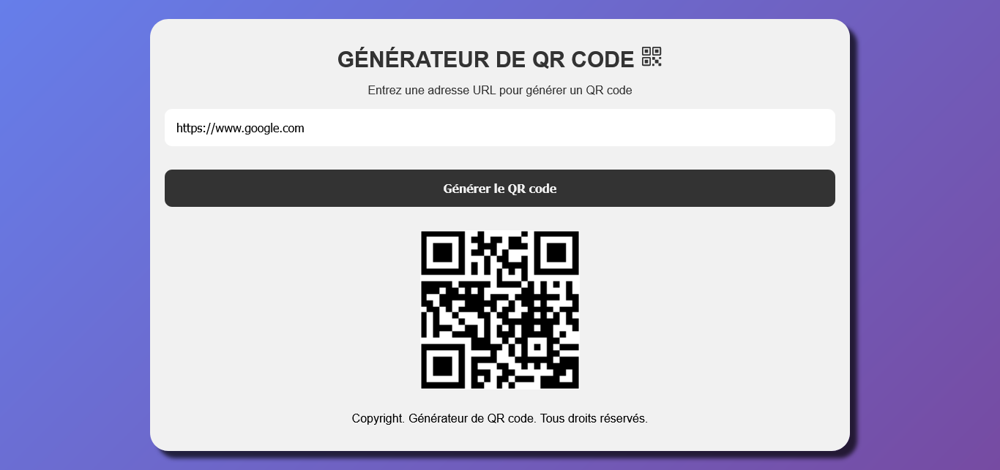

## GENERATEUR DE QR CODE

## Le challenge

Ce site va vous permettre de générer un qr code à partir d'une adresse URL valide.

Une expression régulière est utilisée pour s'assurer que l'URL saisie est valide. Une URL typique peut avoir la forme http://www.example.com/index.html , qui indique un protocole ( http ou https), un nom d'hôte ( www.example.com ) et un nom de fichier ( index.html ).

## Démonstration

Lien vers le projet :

## Projet développé avec

- Utilisation des balises sémantiques HTML5
- CSS3
- Flexbox
- Animation CSS
- Desktop first
- Page web responsive
- JavaScript
- Code JavaScript commenté
